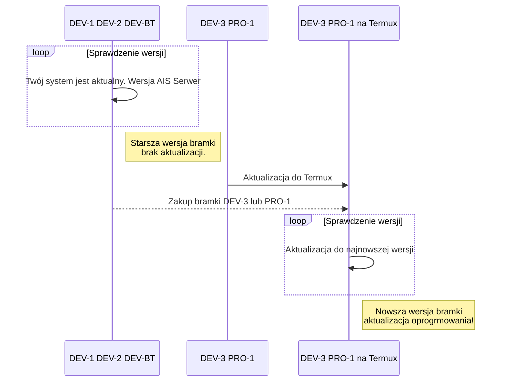

<!--truncate-->

## 无忧升级指南

:::tip[备份 ]

升级前建议先进行[配置备份](/docs/ais_bramka_configuration_software#kopia-zapasowa-konfiguracji)。通过这种方式，您可以在升级前验证配置的正确性，并提高顺利升级的概率。

:::

:::important[控制台 ]

若遇应用升级问题，请通过[控制台手动升级](/docs/ais_bramka_update_manual)，实时查看日志和升级进度，便于诊断问题根源。
:::

:::caution[耐心等待 ]

升级过程及升级后的首次启动可能耗时较长——请保持耐心。您随时可通过控制台命令``htop``或``pm2 logs``查看系统状态（了解网关当前运行情况）。
:::

## 需要帮助？

:::warning[重置 ]
若无法自行诊断问题——无需担心，我们已做好协助准备。我们专门为您设计了简易流程来恢复默认代码和系统设置，详见：[执行完整应用重置](/docs/ais_bramka_reset_ais_step_by_step)。
:::

:::important[返厂编程 ]
若无法完成完整重置流程且系统仍无法运行，您可将设备寄回我们进行编程。论坛帖子详述：[返厂编程服务](https://ai-speaker.discourse.group/t/usluga-programowania-urzadzen-w-ai-speaker/1368)
:::

##  Nikodem版本

本次系统升级将迁移至Termux软件包。Termux是Android的开源终端模拟器，可在Android设备上运行Linux环境，并通过应用包管理器安装额外软件。Termux中的Linux软件包经Android NDK编译，并针对Android兼容性进行了优化。

Termux仓库包含逾1000个软件包。您还可自行编译定制包，因Termux提供包括C、C++、Go、Rust等语言的编译器在内的多种构建工具，以及NodeJS、Python、Ruby等流行语言的解释器。

:::caution[**仅建议在新型号DEV-3和PRO-1网关上迁移至Termux二进制版本**，]
对于使用旧款网关的用户，我们鼓励您参与论坛描述的促销活动购买新款设备：[疑难解答专属优惠](https://ai-speaker.discourse.group/t/na-problemy-promocja/3122)
:::

下方流程图清晰展示了不同型号网关的升级路径。

我们在论坛提供了Termux迁移的逐步指南：[迁移至Termux二进制指南](https://ai-speaker.discourse.group/t/przejscie-na-binarki-termux/2977)

Termux功能及操作说明详见：[Termux维基百科](https://wiki.termux.com/wiki/Getting_started)

###  Zigbee2Mqtt

Zigbee2Mqtt已更新至最新版本。
新版本支持[来自340余家制造商的2500余款设备](https://www.zigbee2mqtt.io/supported-devices/)：

详见Zigbee2Mqtt官方文档：https://www.zigbee2mqtt.io/

###  家庭助理

家庭助理最新版本（即我们基于Home Assistant Core开发的``ais-dom``软件包）。
新版本集成[超过2480种智能设备接入方案](https://www.home-assistant.io/integrations/)：

详见Home Assistant官方文档：https://www.home-assistant.io/integrations/

--------

##### AI-Speaker 2023年1月版